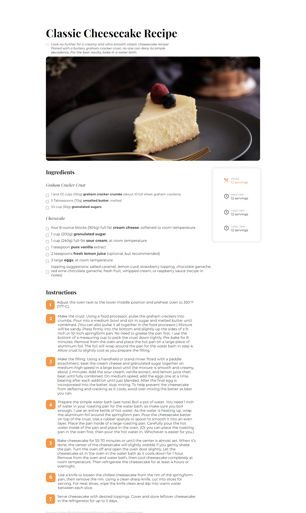
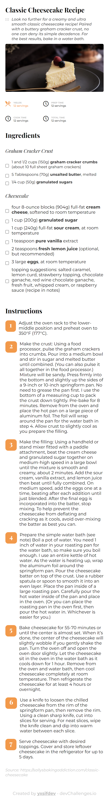

<!-- Please update value in the {}  -->

<h1 align="center">{ My team page }</h1>

   Solution for a challenge from  <a href="http://devchallenges.io" target="_blank">Devchallenges.io</a>.

  <h3>
    <a href="https://recipe-page-ba3.pages.dev/">
      Demo
    </a>
     | 
    <a href="https://github.com/yxsifdev/recipe-page">
      Solution
    </a>
     | 
    <a href="https://devchallenges.io/challenges/wBunSb7FPrIepJZAg0sY">
      Challenge
    </a>
  </h3>

<!-- TABLE OF CONTENTS -->

## Table of Contents

- [Overview](#overview)
  - [Built With](#built-with)
- [Features](#features)
- [Contact](#contact)
- [Acknowledgements](#acknowledgements)

<!-- OVERVIEW -->

## Overview

_On a computer:_

_On a mobile device:_

Introduce your projects by taking a screenshot or a gif. Try to tell visitors a story about your project by answering:

- Where can I see your demo? [The demo here](https://recipe-page-ba3.pages.dev/)
- What was your experience? I feel capable of facing more challenges.
- What have you learned/improved? I have improved in responsive design and animations
- Your wisdom? :)

### Built With

<!-- This section should list any major frameworks that you built your project using. Here are a few examples.-->

- [HTML 5](https://html5.org/)
- [CSS](https://developer.mozilla.org/es/docs/Web/CSS)

## Features

<!-- List the features of your application or follow the template. Don't share the figma file here :) -->

This application/site was created as a submission to a [DevChallenges](https://devchallenges.io/challenges) challenge. The [challenge](https://devchallenges.io/challenges/wBunSb7FPrIepJZAg0sY) was to build an application to complete the given user stories.

## Acknowledgements

<!-- This section should list any articles or add-ons/plugins that helps you to complete the project. This is optional but it will help you in the future. For example -->

- [Steps to replicate a design with only HTML and CSS](https://devchallenges-blogs.web.app/how-to-replicate-design/)
- [Node.js](https://nodejs.org/)
- [Marked - a markdown parser](https://github.com/chjj/marked)

## Contact

- Website [yxsif.pages.app](https://yxsif.pages.dev)
- GitHub [yxsifdev](https://github.com/yxsifdev)
- Twitter [@yxsifdev](https://twitter.com/yxsifdev)
